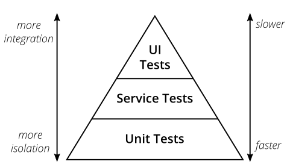
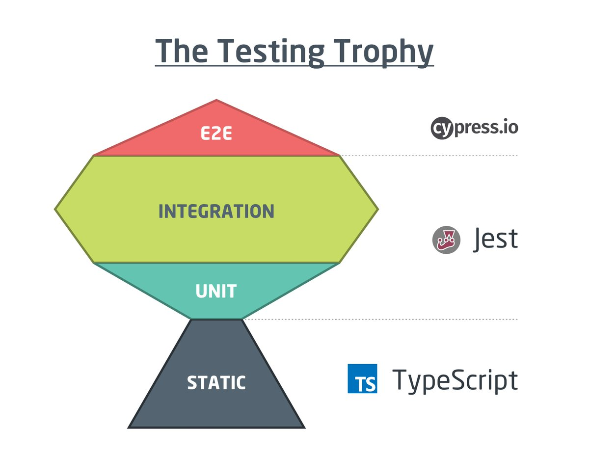

# tdd demo

This is focused on front end testing, in a JavaScript central world.
Many principles likely apply to modern server and API development, but
some elements will be emphasised or diminished in accordance with the
significance for web apps.

## Useful resources

- [Refactoring: Improving the Design of Existing Code (Uncle Bob)](https://www.amazon.co.uk/Refactoring-Improving-Existing-Addison-Wesley-Technology/dp/0134757599/ref=pd_lpo_1?pd_rd_i=0134757599&psc=1)
- [Test Driven Development: By Example (Kent Beck)](https://www.amazon.co.uk/Test-Driven-Development-Addison-Wesley-Signature/dp/0321146530)
- [clean code talk by Uncle Bob](https://www.youtube.com/watch?v=7EmboKQH8lM&list=PLmmYSbUCWJ4x1GO839azG_BBw8rkh-zOj)
- [idris wiki with lots more links](https://github.com/sky-uk/id-idris/wiki/javascript)

## Traditional Testing pyramid

Strongly revolves around MVC and similar approaches, and a seperation
where:

-   logic lives in the server, written as code
-   UI is written as markup and rendered on the client

# Testing Pyramid

# Rumours and hearsay

-   writing tests is hard
-   "I rewrote a whole component tree and I didn't have to change any tests!"

